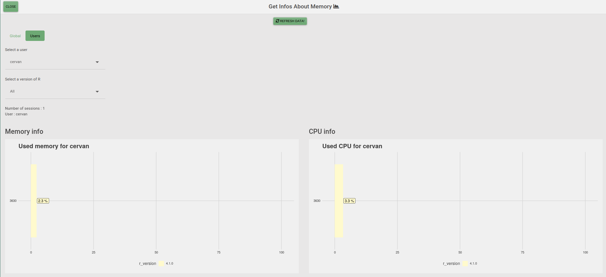

<!-- README.md is generated from README.Rmd. Please edit that file -->

```{r, include = FALSE}
knitr::opts_chunk$set(
  eval=FALSE,
  collapse = TRUE,
  comment = "#>",
  fig.path = "man/figures/README-",
  out.width = "100%"
)
```

<!-- badges: start -->
  [](https://github.com/ThinkR-open/beaware/actions)
<!-- badges: end -->
  
# beaware

This application was developed to monitor the use of your server resources by R and Rstudio.

**Code to work with:** 

* linux server
* to be server administrator (to be able to read user's pid)

## Installation

You can install {beaware} from github with:

```{r}
remotes::install_github("thinkr-open/beaware")
```

## How to use the package ?

To launch the application:

```{r}
beaware::launching_app()
```

This instruction allows to launch application in background.

You can also use the addin to launch the application:

```{r,eval=TRUE, echo=FALSE}
knitr::include_graphics("inst/imgs/addin.png")
```

### How looks the app

```{r, eval=TRUE, echo=FALSE}
knitr::include_graphics("inst/imgs/page_global.png")
```

```{r, eval=TRUE, echo=FALSE}

```

```{r, eval=TRUE, echo=FALSE}
knitr::include_graphics("inst/imgs/page_download.png")
```

# Sponsor

The development of this package has been sponsored by:

<a href = "https://https://www.santepubliquefrance.fr//"></img></a>

# Code of Conduct

Please note that the {beaware} project is released with a Contributor Code of Conduct. By contributing to this project, you agree to abide by its terms.
